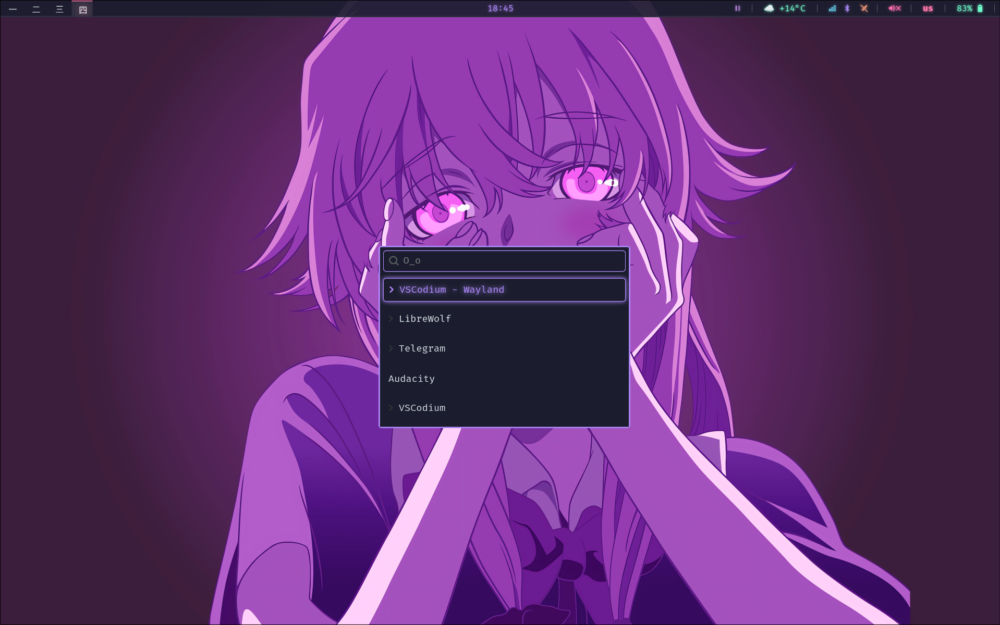
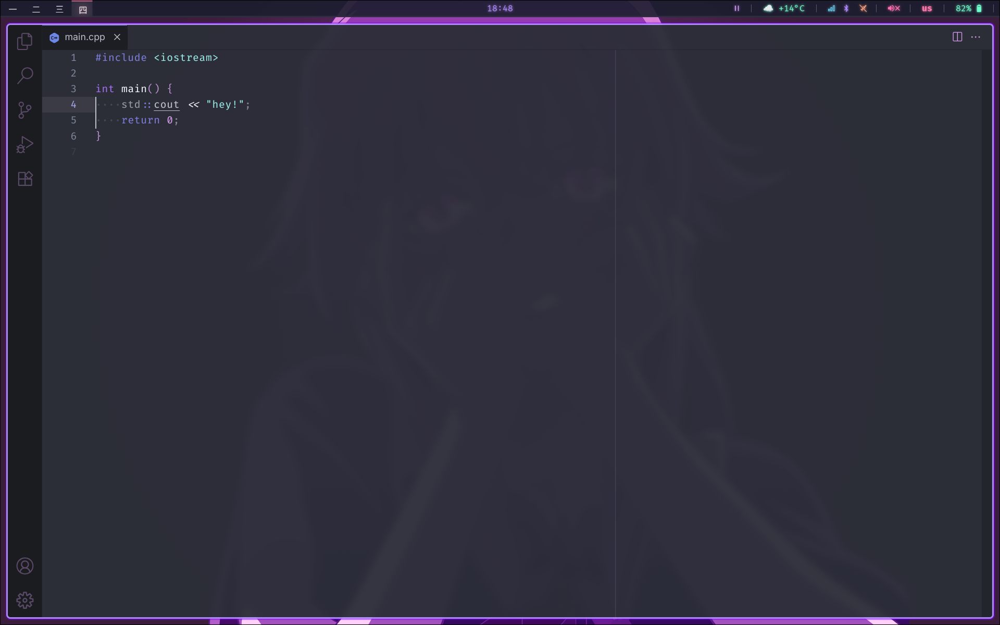

# **‼️‼️‼️ disclaimer ‼️‼️‼️**
### this configuration is designed primarily for Arch Linux but should be compatible with most major distributions.

# 📺 cutelvenok dotfiles

# 🤖 details
- os: [**`arch linux`**](https://archlinux.org/)
- wm: [**`hyprland`**](https://github.com/hyprwm/Hyprland)
- bar: [**`waybar`**](https://github.com/Alexays/Waybar)
- terminal: [**`kitty`**](https://github.com/kovidgoyal/kitty)
- app launcher: [**`wofi`**](https://hg.sr.ht/~scoopta/wofi)
- notify daemon: [**`dunst`**](https://github.com/dunst-project/dunst)
- shell: **`bash`**

# ⌨️ keybinds
all keybinds can be found in the `hyprland` configuration
- **wofi menu** - `super+r`
- **switch workspace** - `super+1...9,0`
- **move window to workspace** - `super+shift+1...9,0`
- **terminal** - `super+return`
- **file browser** - `super+e`
- **lock screen** - `super+l`
- **select new wallpaper** - `super+w`
- **copy emoji** - `super+o`
- **close the window that is in focus** - `super+c`
- **switch the window to floating mode** - `super+v`
- **screenshot a part of your screen** - `super+shift+s`
- **pick color from screen** - `super+shift+x`

# 📄 license
this project is licensed under the [MIT](https://github.com/cutelven0k/dotfiles/blob/main/LICENSE)
